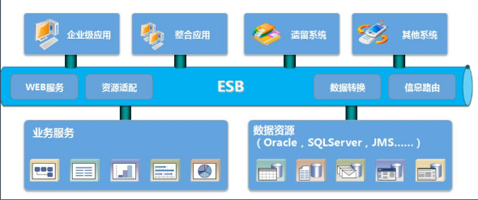
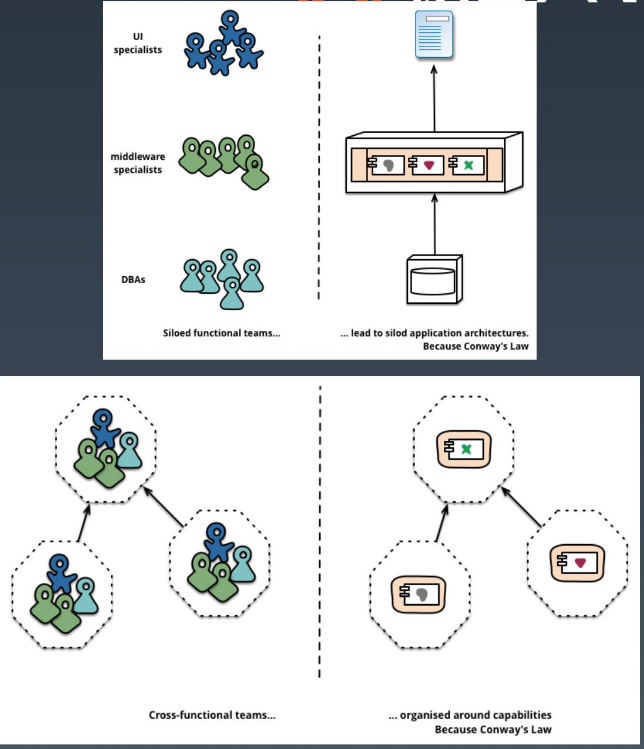
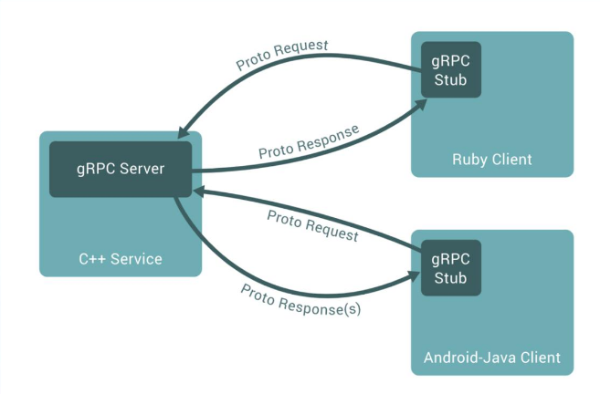

# 微服务概览

## 定义

- 原子服务: 关注单一业务, 轻量级通信机制
- 独立进程, 隔离部署: 虚拟机 --> docker, k8s
- 去中心化服务治理

缺点： 基础设施建设成本(比如测试环境繁琐)和复杂度高。
解决方案：
- 小企业上云
- 大企业做基建，建设微服务(上云容易下云难)

## 特点


`SOA(面向服务)`的一种实践。
- 小即是美, 易于测试和维护,
- 单一职责, 一个服务只需要做好一件事
- 尽可能早的创建原型: 早提供服务API，建立服务契约，实现和完善可慢慢做
- 可一致性 > 效率高


## 组件服务化



- kit: 微服务的基础库，如beego、gin
- server: 业务代码 + kit依赖 + 第三方依赖
- 通讯: rpc(replace http) + message queue(kafka),

多个微服务组合完成一个完整的用户场景usecase


## 按业务组织服务



"U build it and u need fix it, 形成小规模闭环"
大前端(移动/web) => 网关接入 => 业务接入 => 平台服务 => 基础设施


## 去中心化

- 数据去中心化: "每一个微服务独占一个DB"
- 治理去中心化: "把Nginx的集中工作量转移出来""
- 技术去中心化: 技术架构之收敛


## 基础设施自动化

- CICO: Gitlab +Gitlab Hooks + k8s(起容器)
- Testing: 测试环境、单元测试(go test)、API自动化测试(yapi)
- Running online: k8s and 一系列 Prometheus、 ELK ..


## 可用性 & 兼容性设计

"Design For Failure"
- 隔离
- 超时控制
- 负载保护
- 限流
- 降级
- 重试
- 负载均衡
"时刻保持服务契约(接口)的兼容性"


# 微服务设计

## API Gateway

- B站1.0

"前端 - 后端"


```
前后端直接交互，根据资源来设计API调度。
```

- B站2.0  - BFF

"前端 - BFF - 后端"


```
"面向用户场景的API", 在前端和服务端增加一个 app-interface 用于统一协议进出口。
前后端部门耦合在网关部门即可，BFF(Backend for Fronted) "面向前端的后端"。
产生问题：singel app-interface 挂了会引发代码缺陷或流量洪峰
```

- B站3.0
"前端 - 多个BFF - 后端""


```
分布式app-interface, 按照业务场景降低集成度。
产生问题：安全认证、日志监控等等，"升级多个BFF"变得越来越困难
```

- B站4.0  - API-Gateway


```
"引入了API Gateway，于 前端 - API-Gateway(开源Envoy) - BFF - 后端"
加入网关后，BFF实现了解耦合拆分，各业务线团队可以独立开发和交付各自的微服务。
```

## Mircoservice 划分

CQRS, 将APP分为两部分：命令端和查询端。
- 命令端处理程序创建、更新、删除请求，在数据更改时发出事件
- 查询端通过针对一个或多个物化视图执行查询来处理查询

## Mircoservice 安全
- 在API-Gateway进行统一的认证拦截，使用KWT的方式通过RPC传数据到BFF..
- 对服务内部区分身份认证和授权


# gRPC & 服务发现

"A high-performance, open-source universal RPC framework"



- 多语言，兼容性非常高
- 用PB(Protocol Buffer)定义的，序列化更紧凑，比JSON更高性能
- 可插拔
- IDL
- base HTTP2 design


"标准化"优先，然后才是性能优化。


# 多集群 & 多租户

## 考虑多集群的必要性
- 一般 N+2 冗余节点
- 考虑方式: 从单一集群故障带来的影响面角度来考虑冗余


## 多集群
痛点所在:
- 长链接导致的内存和CPU开销
- 短链接产生极大的资源成本和延迟

寻找合适的算法，从全集群里选取一批节点(子集)
- 通常20-100个后端，部分场景需要大子集如大批量读写
- 后端平均分给客户端
- "连接变动最小原则，客户端重启和后端重启保持透明和重新均衡"


## 多租户

一个微服务架构中，模块最有效和提高稳定性的方式是:"多租户"，即多系统共存。

租户栗子：测试，金丝雀发布，shadow system, or 服务层, 产品线 ...

并行测试需要一个和生产环境一样的过渡(staging)环境且只是用来处理测试流量。

测试处理流程：生产代码变动 -> 代码部署到测试栈；
使用"染色发布"，把测试服务B在隔离沙盒环境中启动，在沙盒中可访问环境C、D，测试流量路由到B，保持生产流量正常流入到集成服务。
- 流量路由： 基于流入栈的流量类型做路由
- 隔离性：可靠的隔离测试和生产的资源。


多租户架构本质：
跨服务传递请求携带上下文(context), 数据隔离的流量路由方案。


"理由服务发现注册租户信息，注册成特定的租户"


