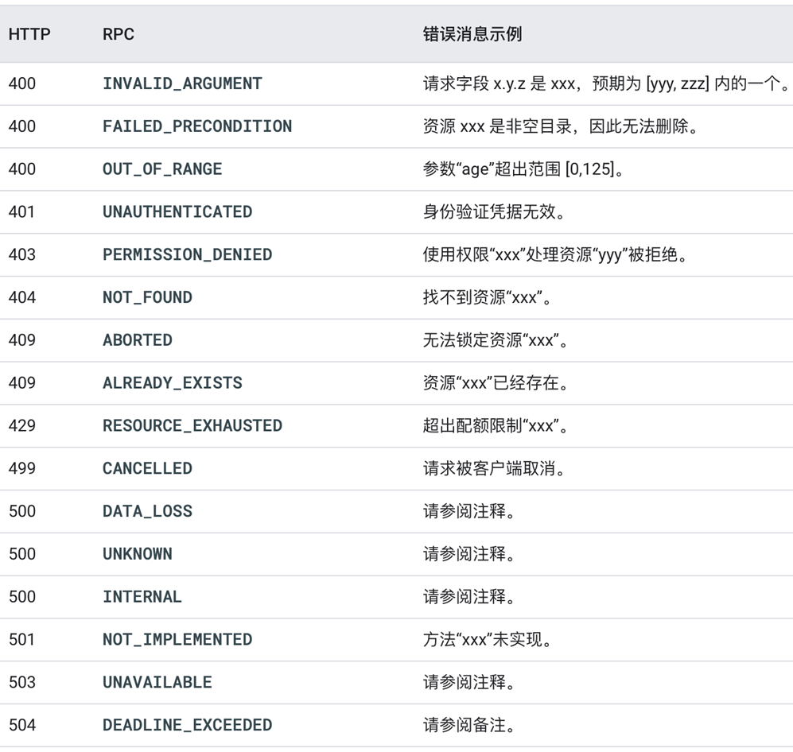

# Go工程化实践

## 作业

[Homework](ProjectDemo/README.md)

Reference: https://go-kratos.dev/#/quickstart

## 工程项目结构

- Must need to read: https://github.com/golang-standards/project-layout
- 小玩具项目可不使用该规范，多人协作时除了根据本篇笔记规范，还应开发一个团队自用的kit-tool，用于快速生成项目模板

- /cmd
    - 项目主干
    - 每个项目应为：/cmd/myapp/main.go, 而不是/cmd/main.go
    - 该目录一般不填加额外的代码
```
├── cmd
│   ├── myapp1
│   │   └── main.go
│   └── myapp2
│       └── main.go
```

- /internal
    - 私有的APP和库代码。
    - 只允许本项目导入，实际APP代码可放在/internal/app下
    - git push前可将本目录添加.gitignore
```
├── internal
│   ├── demo
│   │   ├── biz
│   │   ├── data
│   │   └── service
│   └── pkg               // 私有demo里共用的pkg，和下文的共用pkg不同
```

- /pkg
    - 外部APP可以使用的库代码，会被其他项目引用，放东西请三思。
    - 可以参考go标准库的组织方式
```
├── pkg
│   ├── cache
│   │   ├── memcache
│   │   └── redis
│   └── conf
│       ├── dsn
│       └── env
```
- Kit Project Layout 工具包基础库
    - 每个公司应为不同为服务建立统一的kit工具包项目(公司级建议只有一个)
    - 不允许有vendor，尽可能少的依赖第三方包，让应用选择第三方包而不是kit选择第三方
    - 必要包需要依赖：grpc, proto
    - 统一，标准化布局，高度抽象而不是具体实现，支持插件

- /api
    - API协议定义目录。
    - API的定义如probuf文档等等都先放进来
- /configs
    - 配置文件的模板或默认配置
- /test
    - 额外的外部测试应用程序和测试数据。
    - 较大的项目应该还有测试子目录如:/test/data, /test/apptest
    - 可通过 `.`,`_`来屏蔽go的编译
- ~~/src~~
    - ~~项目里不要包含，干掉~~
- Service Application Project
    - 应用按照业务命名而不是部门命名.防止部门业务变更.
    - 多app方式: app目录内的每个微服务按照自己的全局唯一名称, 比如account.service.vip来建立目录, 该名称还可以用于做服务发现.
    - app服务类型分类
        - interface 对外的BFF服务
        - service 提供对内的服务
        - admin 提供运营侧的微服务,允许更高权限,提供代码安全隔离. 这里与service共享数据, share pattern.
        - job 流式任务处理: 处理kafka、rabbitmq等消息队列的任务
        - task 定时任务, 类似cronjob, 部署到task托管平台中
    - cmd的本质:
        - 资源初始化、注销、监听、关闭
        - 初始化redis mysql dao service log 监听信号

#### 小破站 service app project - v1


```
├── service
│   ├── api          // 放置api定义的protobuf和对应的client代码等等
│   ├── cmd
│   ├── configs      // config file like: database.yaml, redis.yaml     
│   ├── internal     
│   │   ├── model    // 对应"存储层"的结构体，对存储的映射
│   │   └── dao      // 数据访问层，访问mysql/redis等数据库方法，关联调用model，面向的是一张表
│   │   └── service  // 业务逻辑层，依赖倒置service不依赖dao的具体struct 而是依赖dao的interface
│   │   └── server   // 依赖service, 放置grpc、http的起停、路由信息
├── ...
```
- DTO(Data Transfer Object): 数据传输对象，这里用于展示层/api层和服务层之间的数据传输对象
- DO(Damain Object): 领域实体，从现实世界抽象出来的业务实体。
- 项目依赖路径: model -> dao -> service -> api, 直到api需要做DTO对象转换
- v1结论：1.理论上server层可以被干掉, 2.缺乏DTO->DO的对象转换

#### 小破站 service app project - v2

```
├── service
│   ├── api          // 放置api定义的protobuf和对应的client代码等等
│   ├── cmd
│   ├── configs      // config file like: database.yaml, redis.yaml     
│   ├── internal     
│   │   ├── biz      // 业务逻辑层的组装层
│   │   └── data     // 数据访问层，实现biz定义的持久化接口逻辑
│   │   └── pkg      // 实现业务逻辑的地方，依赖倒置 service不依赖dao的具体struct 而是依赖dao的interface
│   │   └── service  // api定义的服务层，这里应只有编排逻辑，不应有业务逻辑
├── ...
```

#### Lifecycle

一个完整化的工程项目，除了项目结构的思考，还有兼具项目服务生命周期的管理。

Reference:
- https://github.com/google/wire
- https://blog.golang.org/wire


## API设计

- Reference:
    - https://github.com/googleapis/googleapis
    - https://github.com/envoyproxy/data-plane-api
    - https://github.com/istio/api

- API管理
    - API目录：统一检索和规范API
    - API project latout
        - "服务-ID-服务具体名称"
    - API Naming Conventions -> RequestURL: /<package_name>.<version>.<service_name>/{method}
        - package <package_name>.<version>
        - package google.example.library.v1

- gRPC
    - 默认使用 Protobuf v3 格式：
        - https://github.com/protocolbuffers/protobuf/blob/master/src/google/protobuf/wrappers.proto


- API Error
    - 一般直接返回http状态码而不是返回200再附加函数内错误
    - "小"错误 -> "大"错误
    - app -> api/errors -> pb -> (1)enum & app -> krotos/errors -> errors.NotFound(1)



## 配置管理

- 环境变量
- 静态配置
    - 需要初始化的HTTP/gRPC/MySQL等等
    - 不鼓励热更新，可以使用平滑更新
- 动态配置
    - https://pkg.go.dev/expvar
- 如何在初始化时传入配置信息
    - 应使用指针传递，而不是值传递
    - 必选参数必填, 可选参数选填


## 包管理

Reference: https://github.com/gomods/athens

## 测试

- 测试金字塔
    - 小型测试 - 单元测试 - kit库、中间件必须要
    - 中型测试 - 集成测试
    - 大型测试 - e2e测试 - 微服务建议只有这个
    - 混沌测试 - 中间件需要
- 单元测试基本要求
    - 快速
    - 环境一致
    - 任意顺序
    - 并行
- 测试中初始化资源配置
    - 利用sync.Once初始化资源配置,但不方便关闭
    - 改进 - 利用TestMain做初始化与关闭
    - 改进 - 利用subTest
- TeseCase
    - 表测试到子测试
    - 利用mock、fake
    - 利用依赖倒置
    - 利用docker compose构建
    - 利用yapi做接口测试
- 整体测试流程
    1. 机遇git branch做feature开发
    2. 本地单元测试、自测
    3. 提交git merge
    4. ci自动验证单元测试
    5. 基于feature branch进行环境构建并功能测试
    6. 合并到master
    7. 再由CI跑一遍单元测试、用yapi做一次正常环境流程的集成测试
    8. 上线后进行回归测试
